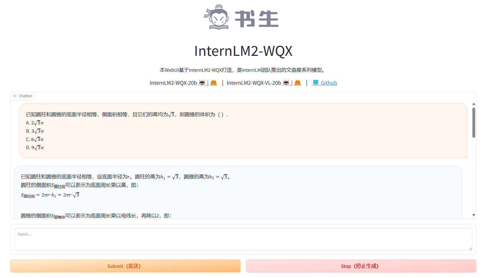
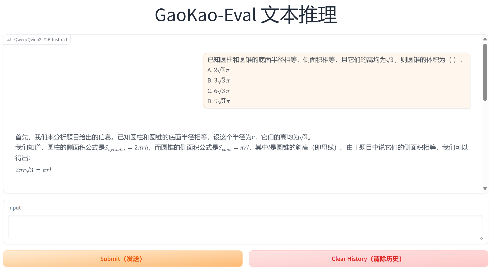
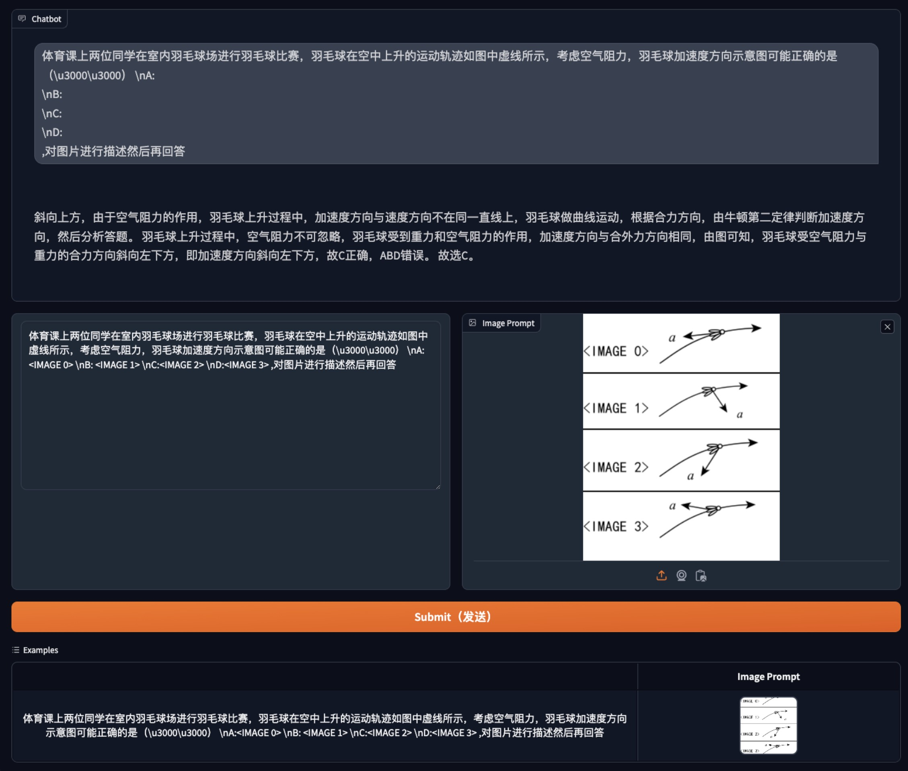

# 快速开始

### Batch 推理 InternLM2-WQX-20B 语言模型

使用transformers后端进行推理：

```
python infer_wqx.py --model_path internlm/internlm2-wqx-20b --source_file source.jsonl --target_file result.jsonl
```

**注意：**

source.jsonl文件中json数据格式如下

```json
{
    "prompt": "题目信息",
    "answer": "题目正确答案"
}
```

### Batch 推理 其他开源模型

使用transformers后端进行推理：

```
python infer_chat.py --model_path Qwen/Qwen2-72B-Instruct --source_file source.jsonl --target_file result.jsonl
```

> 若需推理其他模型，请将`--model_path`后的内容修改为其他模型的**本地路径**或**Hugging Face模型名称**，例如，将`Qwen/Qwen2-72B-Instruct`修改为`  01-ai/Yi-1.5-34B-Chat`

**注意**，该demo仅支持[GAOKAO-Eval](https://github.com/open-compass/GAOKAO-Eval)中所有评测的开源模型，主要包括以下模型：

| 模型                 | Hugging Face 模型名称                 |
| -------------------- | ------------------------------------- |
| 千问2-72B            | Qwen/Qwen2-72B-Instruct               |
| 书生·浦语-文曲星-20B | internlm/internlm2-wqx-20b            |
| 千问2-57B            | Qwen/Qwen2-57B-A14B-Instruct          |
| Yi-1.5-34B           | 01-ai/Yi-1.5-34B-Chat                 |
| GLM4-9B              | THUDM/glm-4-9b-chat                   |
| Mixtral 8x22B        | mistralai/Mixtral-8x22B-Instruct-v0.1 |

因此，已经在代码中做了一些特殊配置，例如：

```python
terminators = [tokenizer.eos_token_id]
config = AutoConfig.from_pretrained(
    model_path, trust_remote_code=True
)
if config.model_type == "chatglm":
    # for glm-4-9b-chat
    device_map = "cuda"
elif config.model_type == "llama":
    # for Yi-1.5-34B-Chat
    terminators += [
        tokenizer.convert_tokens_to_ids("<|eot_id|>"),
        tokenizer.convert_tokens_to_ids("<|im_end|>")
    ]
```

如需对除此以外的其他开源语言模型进行batch推理，可能需要自行在代码中进行额外修改

### InternLM2-WQX-20B 语言模型的 Web UI



使用transformers后端进行推理：

```
python web_ui_wqx.py -m internlm/internlm2-wqx-20b
```

### 其他开源语言模型的 Web UI



使用transformers后端进行推理：

```
python web_ui.py -m Qwen/Qwen2-72B-Instruct
```

> 若需使用其他模型，请将`-m`后的内容修改为其他模型的**本地路径**或**Hugging Face模型名称**，例如，将`Qwen/Qwen2-72B-Instruct`修改为`  01-ai/Yi-1.5-34B-Chat`

**注意**，该demo仅支持**单论对话**，主要用于考卷题目的评测；默认适配[GAOKAO-Eval](https://github.com/open-compass/GAOKAO-Eval)中所有评测的开源模型，因此在代码中做了一些特殊设置，例如：

```python
if args.cpu_only:
    device_map = "cpu"
else:
    device_map = "auto"
    if config.model_type == "chatglm":
        # for glm-4-9b-chat
        device_map = "cuda"
```

以及：

```python
terminators = [tokenizer.eos_token_id]
if config.model_type == "llama":
    # for Yi-1.5-34B-Chat
    terminators += [
        tokenizer.convert_tokens_to_ids("<|eot_id|>"),
        tokenizer.convert_tokens_to_ids("<|im_end|>")
    ]

if config.model_type == "internlm2":
    # for internlm2-wqx-20b
    conversation = [query]
    inputs = tokenizer(conversation, return_tensors="pt")["input_ids"]
else:
    conversation = [{'role': 'user', 'content': query}]
    inputs = tokenizer.apply_chat_template(
        conversation,
        add_generation_prompt=True,
        return_tensors='pt',
    )
```

如需测试此外其他开源语言模型，可能需要自行在代码中进行额外修改

### Batch 推理 InternLM2-WQX-VL-20B 视觉语言模型

使用transformers后端进行推理：
```
cd GAOKAO-Eval
python src/infer_wqx_vl.py --model_path internlm/internlm2-wqx-20b --source_file source.jsonl --target_file result.jsonl
```

**注意：**

source.jsonl文件中json数据格式如下

```json
{
    "prompt": "题目信息",
    "answer": "题目正确答案"
}
```
对于带有图片的多模态考题,题目中的图片是以 HTML 格式嵌入的，例如：

体育课上两位同学在室内羽毛球场进行羽毛球比赛，羽毛球在空中上升的运动轨迹如图中虚线所示，考虑空气阻力，羽毛球加速度方向示意图可能正确的是（ ）
- A: ``
- B: ``
- C: ``
- D: ``

脚本将会提取这些图片并将它们显示在一张合成图片中。在合成图片中，我们将对应的位置标记为 `<IMAGE i>`，并将问题中原有的图片替换为 `<IMAGE i>`。如下图所示:

体育课上两位同学在室内羽毛球场进行羽毛球比赛，羽毛球在空中上升的运动轨迹如图中虚线所示，考虑空气阻力，羽毛球加速度方向示意图可能正确的是（ ）

A:<IMAGE 0> 

B: <IMAGE 1> 

C:<IMAGE 2> 

D:<IMAGE 3>


### InternLM2-WQX-VL-20B 视觉语言模型的 Web UI
使用transformers后端进行推理：

```
cd GAOKAO-Eval/src
python web_ui_wqx_vl.py -m internlm/internlm2-wqx-vl-20b
```
